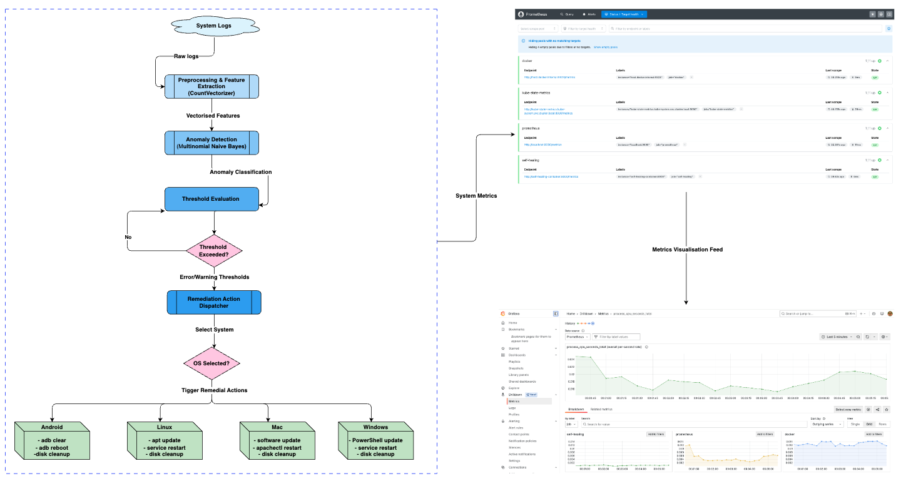

<p align="center">
  
</p>

<h1 align="center">CROSS</h1>
<p align="center"><strong>Cross-platform Remediation and Observability Self-Healing System</strong></p>

<p align="center">
  <em>An intelligent, ML-driven self-healing framework for Android, Linux, macOS, and Windows, integrating real-time observability and automated cross-platform remediation.</em>
</p>

This repository contains an implementation of a self-healing system that performs automated remedial actions (e.g., system updates, service restarts, and resource optimization) upon detecting anomalies in system logs.

## Features

- **Log Analysis**: Detects errors and warnings from system logs.
- **Automated Remedial Actions**: Executes actions such as restarting services, system updates, and resource cleanup.
- **Modular Design**: Built with Python scripts for flexibility and ease of use.
- **Dockerized Environment**: Easily deployable using Docker.
- **Kubernetes Support**: Deploy the application to a Kubernetes cluster for scalability and fault tolerance.
- **Grafana Monitoring**: Track system metrics and remediation actions with Grafana dashboards.

## 📁 Dataset

The full dataset used in this project, including raw logs, extracted features, and preprocessed data, is available on Zenodo:

[](https://doi.org/10.5281/zenodo.15249598)

> **CROSS Dataset:** Multi-Platform System Logs and Preprocessed Data for Self-Healing Evaluation


## Architectural Overview

<p align="center">
  
</p>

**Figure**: *Architectural Overview of the CROSS Framework.*  
A modular design showing OS-specific execution paths and threshold-driven remediation triggers. The system integrates anomaly detection, log vectorisation, rule-based evaluation, and a unified dispatcher to automate recovery actions across Android, Linux, macOS, and Windows. Metrics are exported to Prometheus and visualised via Grafana.

---

## Prerequisites

Before setting up the application, ensure the following tools are installed:

1. **Python**: Version 3.9 or above
2. **Docker & Docker Compose**: Installed and running
3. **Kubernetes**: Installed and configured
4. **Git**: To clone the repository

---

## Setup Instructions

### 1. Clone the Repository

```bash
git clone <repository-url>
cd <repository-folder>
```

## Running the Self-Healing System, Grafana, and Prometheus

### 1. **Build the Docker Image Locally**
Run the following command to build the self-healing system image:
```bash
docker build -t self-healing-system:1.0 .
```

### 2. **Build the Docker Image**:

   ```bash
   docker build -t self-healing-app . 
   
   or without cache:  docker build -t self-healing-app . --no-cache
   ```

### 3. **Run the Container**:

   ```bash
   docker run --rm -it self-healing-app
   ```

### 2. **Start the System with Docker Compose**
Run the following command to start all services:
```bash
docker-compose up -d
```
This will start:
- **Self-Healing System** for log processing and remedial actions
- **Prometheus** for metrics collection
- **Grafana** for real-time visualization

### 3. **Access Prometheus and Grafana**
- **Prometheus Dashboard:** [http://localhost:9090](http://localhost:9090)
- **Grafana Dashboard:** [http://localhost:3000](http://localhost:3000)
  - Username: `admin`
  - Password: `obinna`

### 4. **Verify Running Containers**
Ensure that all containers are running:
```bash
docker ps
```

### 5. **Check Logs for Debugging**
If any service fails to start, check logs using:
```bash
docker-compose logs -f
```

### 6. **Stop and Remove All Services**
To shut down and remove all running containers:
```bash
docker-compose down
```

### 7. **Adding Prometheus as a Data Source in Grafana**
To visualize the self-healing system metrics in Grafana:
1. Open Grafana at [http://localhost:3000](http://localhost:3000).
2. Login with username `admin` and password `admin`.
3. Go to **Configuration** > **Data Sources**.
4. Click **Add data source**.
5. Select **Prometheus**.
6. Set the **URL** to `http://prometheus:9090`.
7. Click **Save & Test**.
8. If successful, you can now create dashboards using Prometheus metrics.

### 8. **Import Grafana Dashboard**
To monitor Kubernetes and Docker performance:
1. In Grafana, go to **Dashboards** > **Import**.
2. Enter the dashboard ID **315** (or another relevant ID from Grafana Labs).
3. Select Prometheus as the data source.
4. Click **Import** to start visualizing system metrics.

Your Grafana dashboard should now display real-time metrics from the self-healing system, including error counts, warnings, and remedial actions performed.

## Kubernetes Deployment

### 1. Start Kubernetes

If you’re using Minikube, start the cluster:

```bash
minikube start
```

For OrbStack, ensure Kubernetes is enabled and running. Verify the node is ready:

```bash
kubectl get nodes -o wide
```

#### 1.1. Deploy Kubernetes Metrics
helm repo add prometheus-community https://prometheus-community.github.io/helm-charts
helm repo update
helm install kube-state-metrics prometheus-community/kube-state-metrics --namespace kube-system

helm upgrade prometheus prometheus-community/prometheus \
  --namespace monitoring \
  --set "serverFiles.prometheus\.yml.scrape_configs[3].static_configs[0].targets[0]=kube-state-metrics.kube-system.svc.cluster.local:8080"


#### 1.2. Deploy Node-Exporter Metrics
helm repo add prometheus-community https://prometheus-community.github.io/helm-charts
helm repo update
helm install node-exporter prometheus-community/prometheus-node-exporter --namespace kube-system


#### 1.3. Install Prometheus in a namespace (e.g. monitoring)
kubectl create namespace monitoring
helm install prometheus prometheus-community/prometheus --namespace monitoring

##### 1.3.1 Verify installation
kubectl get pods -n monitoring


##### 1.3.1 Restart command (after install)
kubectl rollout restart deployment prometheus-server -n monitoring


### 2. Deploy the Application

1. Apply the deployment configuration:

   ```bash
   kubectl apply -f deployment.yaml

   or

   docker-compose -f deployment.yaml up -d

   ```

2. Verify the deployment and pods:

   ```bash
   kubectl get pods
   ```

3. Expose the service using NodePort:

   ```bash
   kubectl expose pod self-healing-container --type=NodePort --port=80
   ```

### 3. Access Grafana Dashboard

1. Get the **Grafana service port**:

   ```bash
   kubectl get svc grafana
   ```

2. Access Grafana at:

   ```
   http://<INTERNAL-IP>:<NodePort>
   ```

   Use `admin` as the username and password.

3. Import the Kubernetes Monitoring Dashboard from Grafana Labs by using the **dashboard ID: 315**.

---

## File Structure

```
.
├── self-healing-trigger/
│   ├── classify-errors-and-trigger-self-healing.py
│   ├── dataset/
│   │   ├── <log files>
│   ├── <other scripts>
├── requirements.txt
├── Dockerfile
├── deployment.yaml
├── docker-compose.yaml
├── prometheus.yml
├── README.md
```

---

## License

This project is licensed under the MIT License. See the LICENSE file for details.
